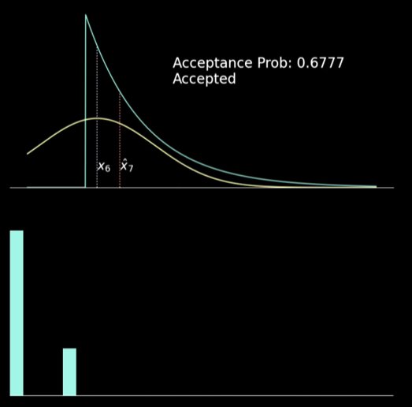

# README
> python version is `3.9.7`.


## Metropolis-Hastings Visualization



```bash
git clone https://github.com/howsmyanimeprofilepicture/viz
cd viz
pip install -r req.txt
python svm-viz.py
```

https://www.youtube.com/watch?v=Q30CGDpXPsI


## Hard Margin SVM 


```bash
git clone https://github.com/howsmyanimeprofilepicture/viz
cd viz
pip install -r req.txt
python svm-viz.py
```
https://www.youtube.com/watch?v=s91ZpxhqHZs


## _

https://www.youtube.com/embed/oo1o2w9Dw80

```bash
git clone https://github.com/howsmyanimeprofilepicture/viz
cd viz
pip install -r req.txt
python saturn2.py
```

